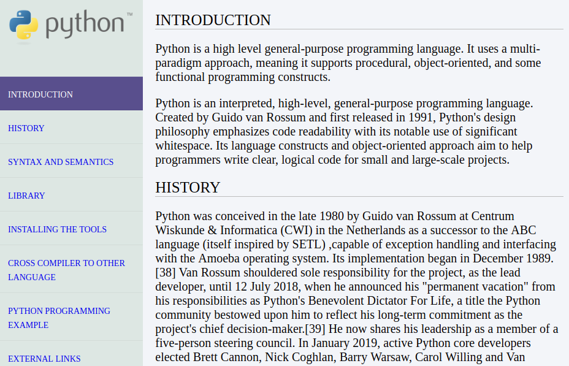

# Python Documentation Page

Python Technical Documentation Page Using HTML/CSS



## Built With

- HTML
- CSS

## Getting Started

- To get a local copy up and running follow these simple steps.

- clone This repository by using following command in your local PC:

```
git clone https://github.com/Div685/TechnicalDocumentationPage.git

```

## Author

👤 **Mian Faizan Ali Full Stack Programmer**

- GitHub: [@Faizanalifullstackprogrammer](https://github.com/Faizanalifullstackprogrammer)
- Twitter: [@mianfaizanali](https://twitter.com/mianfaizanali)
- LinkedIn: [Mianfaizanali](https://pk.linkedin.com/in/mianfaizanali)


## 🤝 Contributing

Contributions, issues, and feature requests are welcome!

Feel free to connect anytime


## 🤝 Contributing

Contributions, issues, and feature requests are welcome!

Feel free to check the [issues page](https://github.com/Div685/TechnicalDocumentationPage/issues).

## Show your support

Give a ⭐️ if you like this project!
